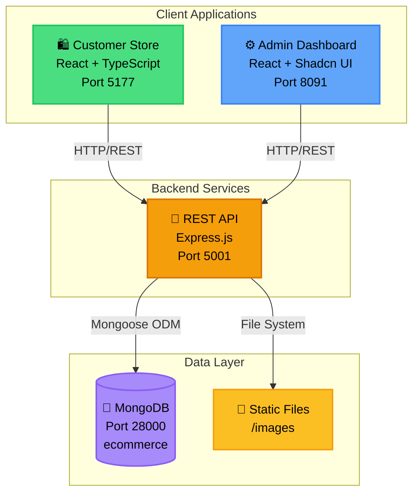
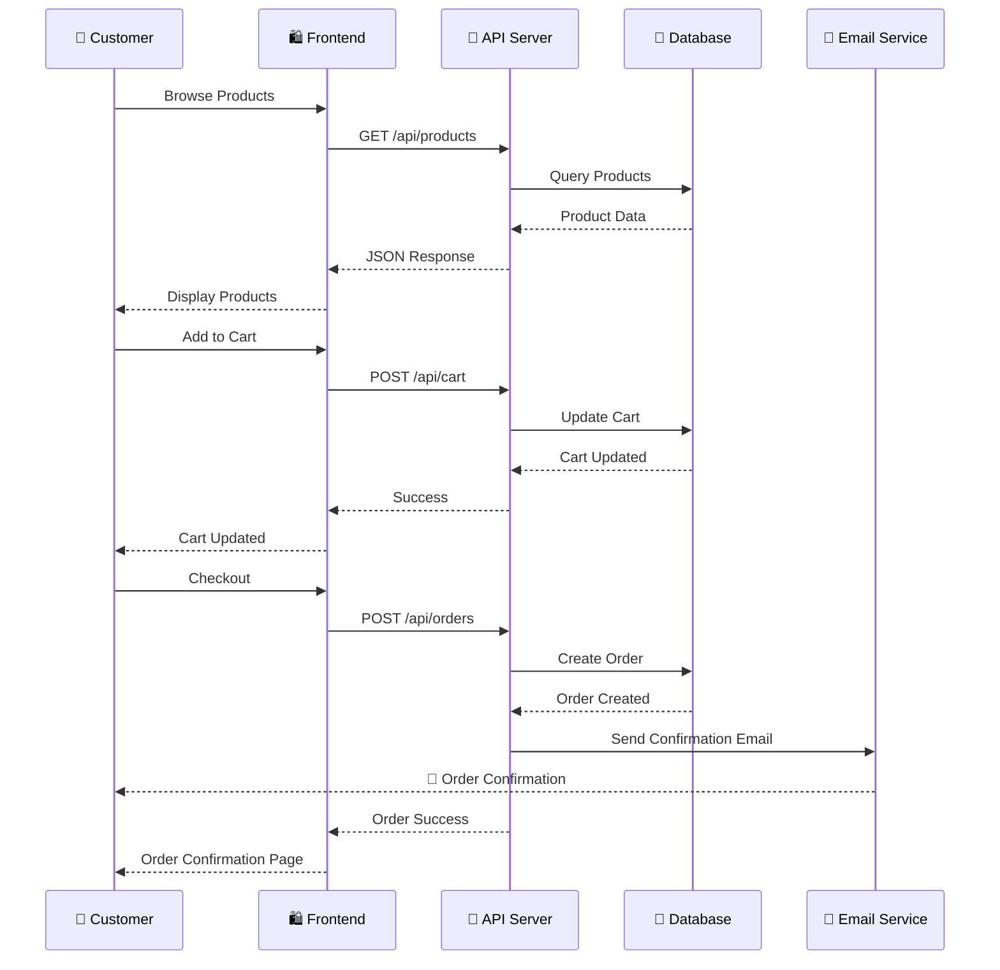
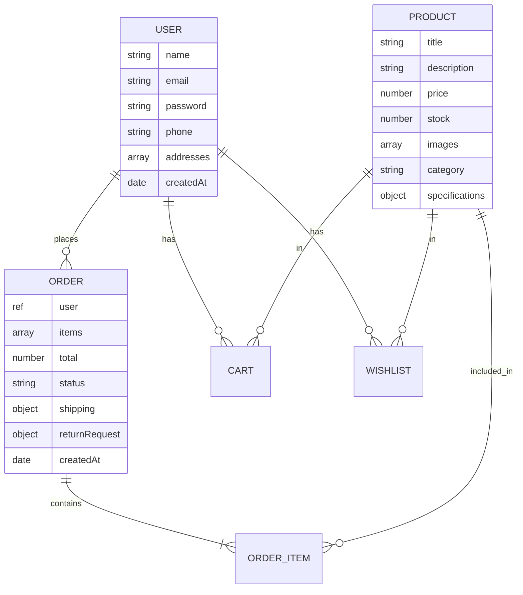

# 🛒 NutriNuts E-Commerce Platform

<div align="center">


**Premium Dry Fruits & Nuts - Full-Stack E-Commerce Solution**

[Features](#-key-features) • [Quick Start](#-quick-start) • [Architecture](#-architecture) • [Documentation](#-documentation) • [API](#-api-reference)

</div>

---

## 📊 System Overview



---

## ✨ Key Features

<table>
<tr>
<td width="50%">

### 🛍️ Customer Experience
- 🎨 Modern, responsive UI with Tailwind CSS
- 🔍 Real-time product search & filtering
- 🛒 Shopping cart with persistent state
- ❤️ Wishlist management
- 📦 Order tracking with status updates
- 🔄 Product return system
- 👤 User authentication & profile
- 💳 Secure checkout process

</td>
<td width="50%">

### ⚙️ Admin Management
- 📊 Comprehensive dashboard analytics
- 📦 Product & inventory management
- 👥 Customer management
- 📋 Order processing & fulfillment
- 🔄 Return request handling
- 🎨 Dynamic site configuration
- 📧 Email template customization
- 👮 Role-based access control

</td>
</tr>
</table>

---

## 🚀 Quick Start

### Prerequisites

```bash
Node.js >= 18.0.0
MongoDB >= 7.0
npm or yarn
```

### ⚡ One-Command Setup

```powershell
# Clone and install
git clone <repository-url>
cd ecommerce

# Install all dependencies
npm run install:all

# Start all services
.\start-workspace.ps1
```

### 📋 Service Access

| Service | URL | Credentials |
|---------|-----|-------------|
| **Customer Store** | http://localhost:5177 | Register new account |
| **Admin Dashboard** | http://localhost:8091 | `superadmin` / `Admin@12345` |
| **API Documentation** | http://localhost:5001/api | - |
| **MongoDB** | mongodb://localhost:28000 | - |

---

## 🏗️ Architecture

### 📁 Repository Structure

```
ecommerce/
│
├── 📂 backend/                    # Express.js REST API
│   ├── 📂 src/
│   │   ├── 📂 controllers/        # Business logic
│   │   ├── 📂 models/             # Mongoose schemas
│   │   ├── 📂 routes/             # API endpoints
│   │   ├── 📂 middleware/         # Auth, validation
│   │   ├── 📂 services/           # Email, uploads
│   │   └── 📂 utils/              # Helpers
│   ├── 📂 scripts/                # DB seeds & utilities
│   ├── 📄 server.js               # Entry point
│   └── 📄 config.env              # Environment config
│
├── 📂 frontend/                   # Customer Store (React)
│   ├── 📂 src/
│   │   ├── 📂 components/         # UI components
│   │   ├── 📂 pages/              # Route pages
│   │   ├── 📂 services/           # API clients
│   │   ├── 📂 hooks/              # Custom React hooks
│   │   └── 📂 types/              # TypeScript definitions
│   └── 📂 tests/                  # Playwright E2E tests
│
├── 📂 adminfrontend/              # Admin Dashboard (React)
│   ├── 📂 src/
│   │   ├── 📂 components/         # Shadcn UI components
│   │   ├── 📂 pages/              # Dashboard pages
│   │   └── 📂 services/           # API clients
│
├── 📂 images/                     # Static image assets
├── 📂 docs/                       # Comprehensive documentation
└── 📄 start-workspace.ps1         # Launch script

```

### 🔄 Data Flow Architecture



---

## 📚 Documentation

### Core Documentation

<table>
<tr>
<td width="50%">

**📚 Getting Started**
- [⚡ Quick Reference](docs/QUICK_REFERENCE.md)
  **START HERE** - Commands, endpoints, troubleshooting
- [📖 Project Overview](docs/01_Project_Overview.md)
  Complete system architecture and setup
- [🏗️ Architecture Guide](docs/ARCHITECTURE.md)
  Technical architecture with diagrams
- [🌐 API Reference](docs/API_REFERENCE.md)
  Complete API endpoint documentation
- [🚀 Deployment Guide](docs/DEPLOYMENT.md)
  Production deployment instructions

</td>
<td width="50%">

**🔧 Operations & Development**
- [✅ Tasks & TODOs](docs/02_Tasks_and_TODOs.md)
  Project roadmap and tracking
- [🔐 Admin Authentication](docs/03_Admin_Auth_Guide.md)
  Admin roles and security
- [📧 Email System](docs/04_Email_Implementation.md)
  Email templates and notifications
- [💡 Knowledge Base](docs/05_Knowledge_Base.md)
  Development patterns
- [🧪 Testing Guide](docs/06_Testing_Guide.md)
  Comprehensive testing docs

</td>
</tr>
</table>

### Quick Reference Guides

<table>
<tr>
<td>

**🔧 Environment Setup**
```bash
# Backend (.env)
DATABASE=mongodb://localhost:28000/ecommerce
JWT_SECRET=your-secret-key
JWT_EXPIRE=7d
SENDGRID_API_KEY=your-key
SENDGRID_FROM_EMAIL=noreply@nutrinuts.com
```

</td>
<td>

**🎯 Key NPM Scripts**
```bash
# Development
npm run dev         # Start dev server
npm run seed        # Seed database
npm run seed:config # Seed site config

# Testing
npm test            # Run tests
npm run test:e2e    # E2E tests
```

</td>
</tr>
</table>

---

## 🌐 API Reference

### Authentication Endpoints

```http
POST   /api/auth/register          # Register new user
POST   /api/auth/login             # User login
GET    /api/auth/me                # Get current user
POST   /api/auth/logout            # Logout user
POST   /api/auth/forgot-password   # Password reset request
PUT    /api/auth/reset-password    # Reset password
```

### Product Endpoints

```http
GET    /api/products               # Get all products
GET    /api/products/:id           # Get single product
POST   /api/products               # Create product (admin)
PUT    /api/products/:id           # Update product (admin)
DELETE /api/products/:id           # Delete product (admin)
GET    /api/products/search        # Search products
```

### Order Endpoints

```http
GET    /api/orders                 # Get user orders
GET    /api/orders/:id             # Get single order
POST   /api/orders                 # Create order
PUT    /api/orders/:id             # Update order status (admin)
POST   /api/orders/:id/return      # Request return
```

### Site Configuration

```http
GET    /api/siteconfig/all         # Get full site config
PUT    /api/siteconfig/all         # Update site config (admin)
GET    /api/siteconfig/branding    # Get branding config
GET    /api/siteconfig/footer      # Get footer config
```

[📖 Complete API Documentation →](docs/01_Project_Overview.md#api-endpoints)

---

## 🗄️ Database Schema

### Core Collections



---

## 🔐 Security Features

| Feature | Implementation |
|---------|----------------|
| **Authentication** | JWT tokens with 7-day expiry |
| **Password Security** | bcrypt hashing with salt rounds |
| **API Protection** | Protected routes with middleware |
| **Role-Based Access** | Admin priority levels (1-100) |
| **Input Validation** | Mongoose schema validation |
| **CORS** | Configured cross-origin policies |
| **Environment Variables** | Sensitive data in .env files |

---

## 🧪 Testing

### Test Coverage

```bash
┌─────────────────────────────┬──────────┐
│ Component                   │ Tests    │
├─────────────────────────────┼──────────┤
│ Navbar & Navigation         │ 30       │
│ Product Listing & Filters   │ 80       │
│ Checkout Flow               │ 80       │
│ Cart & Wishlist             │ 60       │
│ User Authentication         │ 50       │
│ Admin Dashboard             │ 40       │
│ Return System               │ 15       │
│ Responsive Design           │ 100      │
│ Accessibility (A11y)        │ 50       │
├─────────────────────────────┼──────────┤
│ TOTAL                       │ 505      │
└─────────────────────────────┴──────────┘
```

### Running Tests

```bash
# Frontend E2E Tests
cd frontend
npx playwright test                    # Run all tests
npx playwright test --headed           # Watch tests
npx playwright test --ui               # Interactive UI
npx playwright test --reporter=html    # Generate report

# Backend Unit Tests
cd backend
npm test                               # Run unit tests
npm run test:watch                     # Watch mode
```

---

## 🚀 Deployment

### Production Checklist

- [ ] Update environment variables
- [ ] Change default admin password
- [ ] Configure CORS origins
- [ ] Set up SSL/TLS certificates
- [ ] Configure MongoDB replica set
- [ ] Set up email service (SendGrid)
- [ ] Configure file upload limits
- [ ] Enable rate limiting
- [ ] Set up monitoring & logging
- [ ] Configure backup strategy

### Recommended Stack

| Layer | Technology |
|-------|-----------|
| **Hosting** | AWS EC2, DigitalOcean, Heroku |
| **Database** | MongoDB Atlas |
| **CDN** | Cloudflare, AWS CloudFront |
| **Email** | SendGrid, AWS SES |
| **Monitoring** | PM2, New Relic |

---

## 🤝 Contributing

We welcome contributions! Please follow these guidelines:

1. Fork the repository
2. Create a feature branch (`git checkout -b feature/AmazingFeature`)
3. Commit your changes (`git commit -m 'Add some AmazingFeature'`)
4. Push to the branch (`git push origin feature/AmazingFeature`)
5. Open a Pull Request

---

## 📄 License

This project is licensed under the MIT License - see the [LICENSE](LICENSE) file for details.

---

## 📞 Support

<div align="center">

**Need Help?**

[📧 Email Support](mailto:support@nutrinuts.com) • [📖 Documentation](docs/) • [🐛 Report Bug](issues)

---

Made with ❤️ by the NutriNuts Team

</div>
