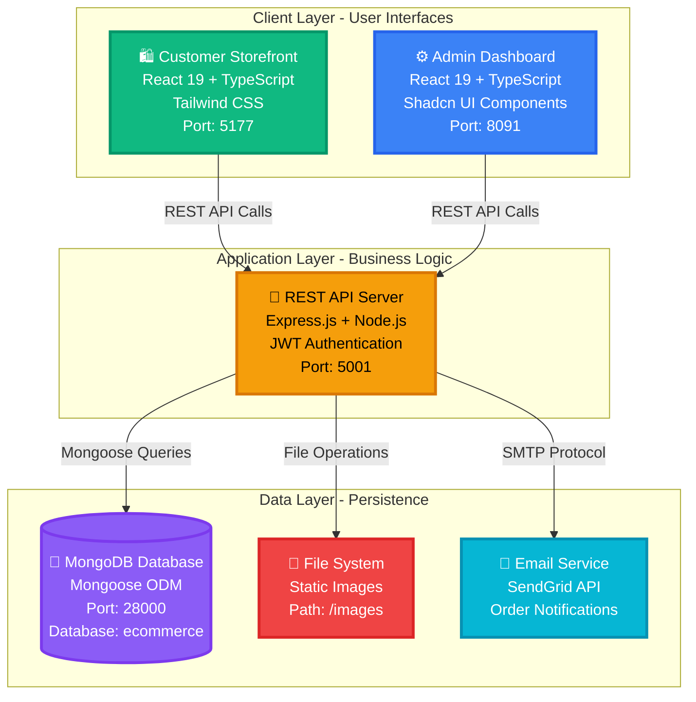
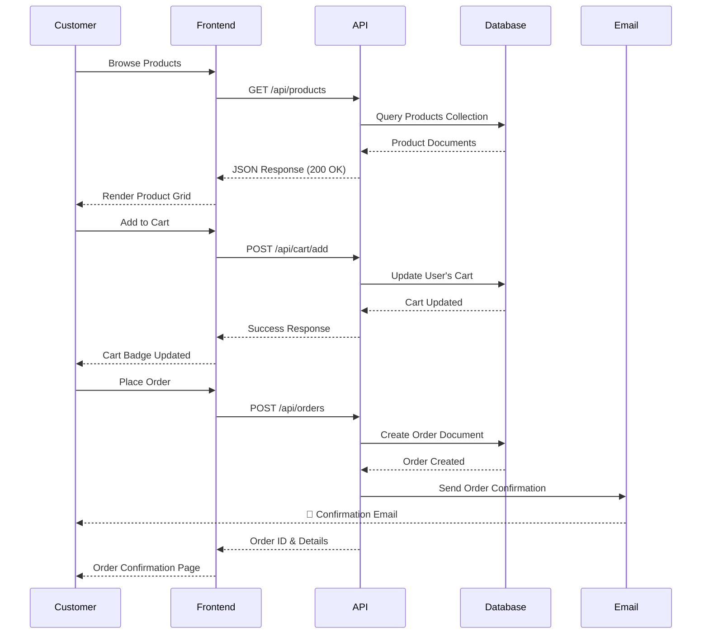

# 🛒 E-Commerce Platform - Technical Documentation

<div align="center">


**NutriNuts Premium Dry Fruits & Nuts - Full-Stack Solution**

</div>

---

## 📋 Table of Contents

<table>
<tr>
<td width="50%">

**Getting Started**
- [🎯 Project Overview](#-project-overview)
- [🚀 Quick Start](#-quick-start-guide)
- [🏗️ Architecture](#-system-architecture)
- [📦 Installation](#-installation-setup)

</td>
<td width="50%">

**Technical Reference**
- [🛠️ Technology Stack](#️-technology-stack)
- [🗄️ Database Schema](#️-database-models)
- [🌐 API Endpoints](#-api-reference)
- [🔐 Security](#-authentication--security)

</td>
</tr>
</table>

---

## 🎯 Project Overview

### Business Context

**NutriNuts** is a modern e-commerce platform specializing in premium dry fruits and nuts. The platform provides a complete solution for online retail operations with separate interfaces for customers and administrators.

### System Capabilities Matrix

<table>
<tr>
<th width="25%">Category</th>
<th width="75%">Features</th>
</tr>

<tr>
<td><strong>🛍️ Shopping</strong></td>
<td>
• Product catalog with advanced filtering<br/>
• Real-time search with suggestions<br/>
• Shopping cart with persistent state<br/>
• Wishlist management<br/>
• Product recommendations
</td>
</tr>

<tr>
<td><strong>👤 User Management</strong></td>
<td>
• JWT-based authentication<br/>
• Email verification with OTP<br/>
• Password reset flow<br/>
• Profile management<br/>
• Address book
</td>
</tr>

<tr>
<td><strong>📦 Orders</strong></td>
<td>
• Secure checkout process<br/>
• Order tracking with real-time updates<br/>
• Email notifications at each stage<br/>
• Return request system<br/>
• Order history
</td>
</tr>

<tr>
<td><strong>⚙️ Administration</strong></td>
<td>
• Product & inventory management<br/>
• Order processing & fulfillment<br/>
• Customer analytics dashboard<br/>
• Site configuration (branding, content)<br/>
• Role-based admin access (Priority 1-100)
</td>
</tr>

<tr>
<td><strong>🎨 Customization</strong></td>
<td>
• Dynamic branding (colors, logos)<br/>
• Hero carousel management<br/>
• Featured collections<br/>
• Footer & contact information<br/>
• Email template customization
</td>
</tr>
</table>

---

## 🏗️ System Architecture

### High-Level Architecture Diagram



### Request Flow Sequence



---

## 🚀 Quick Start Guide

### Prerequisites Checklist

```bash
✓ Node.js >= 18.0.0
✓ MongoDB >= 7.0 (running on port 28000)
✓ npm >= 9.0.0 or yarn >= 1.22.0
✓ Git for version control
```

### Installation Setup

<table>
<tr>
<td width="50%">

**Option 1: Automated Setup** ⚡

```powershell
# Clone repository
git clone <repo-url>
cd ecommerce

# One-command install
npm run install:all

# Start all services
.\start-workspace.ps1
```

</td>
<td width="50%">

**Option 2: Manual Setup** 🔧

```bash
# Backend
cd backend
npm install
npm run seed
npm run seed:config

# Frontend
cd ../frontend
npm install

# Admin
cd ../adminfrontend
npm install
```

</td>
</tr>
</table>

### Service Port Reference

| Service | Port | URL | Status |
|---------|------|-----|--------|
| 🚀 **Backend API** | 5001 | http://localhost:5001 | Required |
| 🛍️ **Customer Store** | 5177 | http://localhost:5177 | Required |
| ⚙️ **Admin Dashboard** | 8091 | http://localhost:8091 | Required |
| 💾 **MongoDB** | 28000 | mongodb://localhost:28000 | Required |

### Default Credentials

```yaml
Admin Panel:
  URL: http://localhost:8091
  Username: superadmin
  Password: Admin@12345
  Priority: 1 (Super Admin)
  
⚠️ SECURITY: Change password immediately after first login!
```

---

## 🛠️ Technology Stack

### Complete Technology Matrix

<table>
<tr>
<th>Layer</th>
<th>Technology</th>
<th>Version</th>
<th>Purpose</th>
</tr>

<!-- Frontend -->
<tr>
<td rowspan="7"><strong>Frontend<br/>Applications</strong></td>
<td>React</td>
<td>19.1.x</td>
<td>UI framework with hooks & concurrent features</td>
</tr>
<tr>
<td>TypeScript</td>
<td>5.8.x</td>
<td>Type safety & developer experience</td>
</tr>
<tr>
<td>Vite</td>
<td>5.4.x / 7.0.x</td>
<td>Fast build tool & HMR dev server</td>
</tr>
<tr>
<td>Tailwind CSS</td>
<td>3.4.x</td>
<td>Utility-first styling framework</td>
</tr>
<tr>
<td>React Router</td>
<td>7.7.x</td>
<td>Client-side routing & navigation</td>
</tr>
<tr>
<td>Shadcn UI</td>
<td>Latest</td>
<td>Admin dashboard component library</td>
</tr>
<tr>
<td>Playwright</td>
<td>Latest</td>
<td>E2E testing framework</td>
</tr>

<!-- Backend -->
<tr>
<td rowspan="6"><strong>Backend<br/>Services</strong></td>
<td>Node.js</td>
<td>18.x+</td>
<td>JavaScript runtime environment</td>
</tr>
<tr>
<td>Express.js</td>
<td>4.21.x</td>
<td>Web application framework</td>
</tr>
<tr>
<td>Mongoose</td>
<td>8.9.x</td>
<td>MongoDB ODM for data modeling</td>
</tr>
<tr>
<td>bcrypt</td>
<td>5.1.x</td>
<td>Password hashing & security</td>
</tr>
<tr>
<td>jsonwebtoken</td>
<td>9.0.x</td>
<td>JWT token generation & validation</td>
</tr>
<tr>
<td>SendGrid</td>
<td>Latest</td>
<td>Transactional email delivery</td>
</tr>

<!-- Database -->
<tr>
<td rowspan="2"><strong>Database<br/>& Storage</strong></td>
<td>MongoDB</td>
<td>7.0+</td>
<td>NoSQL document database</td>
</tr>
<tr>
<td>File System</td>
<td>-</td>
<td>Local image storage</td>
</tr>

<!-- DevOps -->
<tr>
<td rowspan="3"><strong>DevOps<br/>& Tools</strong></td>
<td>ESLint</td>
<td>9.17.x</td>
<td>Code quality & linting</td>
</tr>
<tr>
<td>Prettier</td>
<td>Latest</td>
<td>Code formatting</td>
</tr>
<tr>
<td>Git</td>
<td>2.x+</td>
<td>Version control system</td>
</tr>
</table>

---

## 📁 Project Structure

### Repository Architecture

```
ecommerce/                              # Root monorepo
│
├── 📂 backend/                         # Express.js REST API (Port: 5001)
│   ├── 📂 src/
│   │   ├── 📂 controllers/             # Business logic handlers
│   │   │   ├── authController.js       # User authentication
│   │   │   ├── productController.js    # Product operations
│   │   │   ├── orderController.js      # Order management
│   │   │   ├── cartController.js       # Shopping cart
│   │   │   ├── adminAuthController.js  # Admin authentication
│   │   │   └── adminOrderController.js # Admin order operations
│   │   │
│   │   ├── 📂 models/                  # Mongoose schemas
│   │   │   ├── User.js                 # Customer accounts
│   │   │   ├── Product.js              # Product catalog
│   │   │   ├── Order.js                # Order documents
│   │   │   ├── Admin.js                # Admin accounts
│   │   │   └── SiteConfig.js           # Dynamic configuration
│   │   │
│   │   ├── 📂 routes/                  # API endpoint definitions
│   │   │   ├── authRoutes.js           # /api/auth/*
│   │   │   ├── productRoutes.js        # /api/products/*
│   │   │   ├── orderRoutes.js          # /api/orders/*
│   │   │   └── siteConfigRoutes.js     # /api/siteconfig/*
│   │   │
│   │   ├── 📂 middleware/              # Express middleware
│   │   │   ├── auth.js                 # JWT verification
│   │   │   ├── adminAuth.js            # Admin authorization
│   │   │   └── errorHandler.js         # Global error handling
│   │   │
│   │   ├── 📂 services/                # External services
│   │   │   ├── emailService.js         # SendGrid integration
│   │   │   └── uploadService.js        # File uploads
│   │   │
│   │   ├── 📂 utils/                   # Helper functions
│   │   │   ├── orderEmails.js          # Email templates
│   │   │   └── validators.js           # Input validation
│   │   │
│   │   └── 📂 config/                  # Configuration files
│   │       ├── db.js                   # MongoDB connection
│   │       └── emailConfig.js          # Email settings
│   │
│   ├── 📂 scripts/                     # Database utilities
│   │   ├── seedDatabase.js             # Product seeding
│   │   ├── seed-site-config.js         # Site config seeding
│   │   ├── createAdmin.js              # Create admin users
│   │   └── update-order-delivered.js   # Testing utilities
│   │
│   ├── 📄 server.js                    # Application entry point
│   ├── 📄 config.env                   # Environment variables
│   └── 📄 package.json                 # Dependencies & scripts
│
├── 📂 frontend/                        # Customer Store (Port: 5177)
│   ├── 📂 src/
│   │   ├── 📂 components/              # React components
│   │   │   ├── Navbar.tsx              # Navigation bar
│   │   │   ├── Footer.tsx              # Site footer
│   │   │   ├── HeroCarousel.tsx        # Home page carousel
│   │   │   ├── ProductListingPage.tsx  # Product grid
│   │   │   ├── ProductDetailPage.tsx   # Product details
│   │   │   ├── OrderTracking.tsx       # Order tracking
│   │   │   └── Toast.tsx               # Notification system
│   │   │
│   │   ├── 📂 pages/                   # Route components
│   │   │   ├── CartPage.jsx            # Shopping cart
│   │   │   ├── WishlistPage.tsx        # Wishlist
│   │   │   ├── CheckoutPage.tsx        # Checkout flow
│   │   │   ├── AccountPage.tsx         # User profile
│   │   │   └── PoliciesPage.tsx        # Legal pages
│   │   │
│   │   ├── 📂 services/                # API client services
│   │   │   ├── authService.js          # Authentication API
│   │   │   ├── dataService.js          # Product API
│   │   │   ├── orderService.js         # Order API
│   │   │   ├── cartService.js          # Cart API
│   │   │   └── siteConfigService.js    # Config API
│   │   │
│   │   ├── 📂 hooks/                   # Custom React hooks
│   │   │   └── useSiteConfig.js        # Site config hook
│   │   │
│   │   ├── 📂 types/                   # TypeScript definitions
│   │   │   ├── Product.ts              # Product interfaces
│   │   │   ├── SiteConfig.ts           # Config interfaces
│   │   │   └── index.ts                # Exports
│   │   │
│   │   ├── 📄 App.tsx                  # Root component
│   │   ├── 📄 main.tsx                 # Application entry
│   │   └── 📄 index.css                # Global styles
│   │
│   ├── 📂 tests/                       # E2E tests (Playwright)
│   │   ├── comprehensive.spec.ts       # Main test suite
│   │   ├── returns.spec.ts             # Return system tests
│   │   └── account-page-responsive.spec.ts
│   │
│   ├── 📄 vite.config.ts               # Vite configuration
│   ├── 📄 tailwind.config.js           # Tailwind CSS config
│   └── 📄 package.json                 # Dependencies
│
├── 📂 adminfrontend/                   # Admin Dashboard (Port: 8091)
│   ├── 📂 src/
│   │   ├── 📂 components/              # UI components
│   │   │   ├── 📂 ui/                  # Shadcn components
│   │   │   ├── 📂 siteconfig/          # Config editors
│   │   │   │   ├── ProductPagesTab.tsx
│   │   │   │   ├── HeroCarouselTab.tsx
│   │   │   │   └── FooterTab.tsx
│   │   │   └── Sidebar.tsx             # Navigation sidebar
│   │   │
│   │   ├── 📂 pages/                   # Dashboard pages
│   │   │   ├── Dashboard.tsx           # Analytics overview
│   │   │   ├── ProductManagement.tsx   # Product CRUD
│   │   │   ├── OrderManagement.tsx     # Order processing
│   │   │   ├── CustomerManagement.tsx  # Customer data
│   │   │   ├── AdminManagement.tsx     # Admin users
│   │   │   └── SiteConfiguration.tsx   # Site settings
│   │   │
│   │   ├── 📂 services/                # API services
│   │   │   ├── api.ts                  # API client
│   │   │   └── auth.ts                 # Admin auth
│   │   │
│   │   ├── 📄 App.tsx                  # Root component
│   │   └── 📄 main.tsx                 # Entry point
│   │
│   └── 📄 package.json                 # Dependencies
│
├── 📂 images/                          # Static assets
│   ├── hero-1.png ... hero-6.png       # Hero carousel images
│   ├── almond-1.png ... almond-5.png   # Product images
│   ├── cashew-1.png ... cashew-4.png
│   ├── pistachio-1.png ... pistachio-3.png
│   └── qrcode-*.png                    # Payment QR codes
│
├── 📂 docs/                            # Documentation
│   ├── 01_Project_Overview.md          # This file
│   ├── 02_Tasks_and_TODOs.md           # Project roadmap
│   ├── 03_Admin_Auth_Guide.md          # Admin authentication
│   ├── 04_Email_Implementation.md      # Email system
│   ├── 05_Knowledge_Base.md            # Best practices
│   └── 06_Testing_Guide.md             # Testing docs
│
├── 📄 start-workspace.ps1              # Launch all services
├── 📄 test-dummy-data.sh               # Test data script
└── 📄 README.md                        # Main documentation
```

---

## 🗄️ Database Models
| **GSAP** | 3.13.x | Animation library |
| **Axios** | 1.11.x / 1.12.x | HTTP client |
| **Lucide React** | 0.536.x | Icon library |
| **Heroicons** | 2.2.x | Additional icons |

### Admin Dashboard Extras

| Technology | Purpose |
|------------|---------|
| **Monaco Editor** | Code/JSON editing |
| **Radix UI** | Accessible UI primitives |
| **Recharts** | Data visualization |
| **React Hot Toast** | Notifications |

### Backend

| Technology | Version | Purpose |
|------------|---------|---------|
| **Node.js** | ≥16.0.0 | Runtime environment |
| **Express** | 4.18.x | Web framework |
| **MongoDB** | - | NoSQL database |
| **Mongoose** | 8.0.x | MongoDB ODM |
| **JWT** | 9.0.x | Authentication tokens |
| **bcryptjs** | 3.0.x | Password hashing |
| **Multer** | 2.0.x | File upload handling |
| **SendGrid** | 8.1.x | Email sending (via @sendgrid/mail) |
| **Helmet** | 8.1.x | Security headers |
| **CORS** | 2.8.x | Cross-origin requests |

---

## 🚀 Services & Ports

| Service | Port | Description | Command |
|---------|------|-------------|---------|
| **Backend API** | 5001 | Express REST API server | `cd backend && npm run dev` |
| **Frontend Store** | 5177 | Customer storefront | `cd frontend && npm run dev` |
| **Admin Dashboard** | 8091 | Admin management panel | `cd adminfrontend && npm run dev` |

| **MongoDB** | 28000 | Database server | External service |

### Starting All Services

**Option 1: VS Code Tasks**
```
Ctrl+Shift+P → "Run Task" → "Start Workspace"
```

**Option 2: PowerShell Script**
```powershell
.\start-workspace.ps1
```

**Option 3: Manual Start**
```powershell
# Terminal 1 - Backend
cd backend; npm run dev

# Terminal 2 - Frontend
cd frontend; npm run dev

# Terminal 3 - Admin Dashboard
cd adminfrontend; npm run dev
```

---

## 🗄️ Backend API

### Directory Structure

```
backend/
├── server.js                 # Entry point & Express app configuration
├── config.env                # Environment variables
├── package.json              # Dependencies
├── scripts/                  # Database seeding & utility scripts
│   ├── seedDatabase.js       # Seed products
│   ├── seedSiteConfig.js     # Seed site configuration
│   ├── seed-featured-collections.js
│   ├── seed-footer-data.js
│   └── ...
└── src/
    ├── config/               # Database & app configuration
    ├── controllers/          # Request handlers
    ├── middleware/           # Auth, error handling, etc.
    ├── models/               # Mongoose schemas
    ├── routes/               # API route definitions
    ├── services/             # Business logic services
    └── utils/                # Helper utilities
```

### API Route Modules

| Route File | Base Path | Purpose |
|------------|-----------|---------|
| `productRoutes.js` | `/api/products` | Product CRUD operations |
| `categoryRoutes.js` | `/api/categories` | Category management |
| `authRoutes.js` | `/api/auth` | Authentication (login, signup, password reset) |
| `userRoutes.js` | `/api/users` | User profile management |
| `cartRoutes.js` | `/api/cart` | Shopping cart operations |
| `wishlistRoutes.js` | `/api/wishlist` | Wishlist management |
| `orderRoutes.js` | `/api/orders` | Customer order operations |
| `adminOrderRoutes.js` | `/api/admin/orders` | Admin order management |
| `customerRoutes.js` | `/api/admin/customers` | Admin customer management |
| `siteConfigRoutes.js` | `/api/siteconfig` | Site configuration |
| `imageRoutes.js` | `/api/images` | Image upload & retrieval |
| `analyticsRoutes.js` | `/api/analytics` | Sales & visitor analytics |

### CORS Configuration

The backend accepts requests from:
- `http://localhost:5173`
- `http://localhost:5177`
- `http://localhost:5174`
- `http://localhost:8090`
- `http://localhost:8091`

---

## 🛍️ Frontend Store

### Directory Structure

```
frontend/
├── index.html                # HTML entry point
├── package.json              # Dependencies
├── vite.config.ts            # Vite configuration
├── tailwind.config.js        # Tailwind CSS configuration
└── src/
    ├── App.tsx               # Root component with routing
    ├── main.tsx              # Application entry point
    ├── index.css             # Global styles
    ├── components/           # Reusable UI components
    ├── pages/                # Route-level page components
    ├── services/             # API service modules
    ├── hooks/                # Custom React hooks
    ├── types/                # TypeScript type definitions
    └── data/                 # Static data files
```

### Key Components

| Component | Description |
|-----------|-------------|
| `AnnouncementBar.tsx` | Top promotional banner |
| `Navbar.tsx` | Main navigation with search |
| `HeroCarousel.tsx` | Homepage hero slider |
| `HotDealsSection.tsx` | Featured deals grid |
| `TwoBoxSection.tsx` | Featured collections display |
| `ProductListingPage.tsx` | Product catalog with filters |
| `ProductDetailPage.tsx` | Individual product view |
| `TestimonialSection.tsx` | Customer reviews carousel |
| `Footer.tsx` | Site footer with links |
| `LoginModal.tsx` | User login modal |
| `RegisterModal.tsx` | User registration modal |
| `SearchSidebar.tsx` | Product search interface |
| `WelcomePopup.tsx` | Post-login welcome message |

### Application Routes

| Path | Component | Description |
|------|-----------|-------------|
| `/` | `HomePage` | Landing page with hero, deals, collections |
| `/home` | `HomePage` | Alias for landing page |
| `/products` | `ProductListingPage` | Product catalog |
| `/shop` | `ProductListingPage` | Alias for products |
| `/product/:id` | `ProductDetailPage` | Product details |
| `/contact` | `ContactUs` | Contact information |
| `/faq` | `FAQPage` | Frequently asked questions |
| `/account` | `AccountPage` | User profile |
| `/wishlist` | `WishlistPage` | User's saved items |
| `/cart` | `CartPage` | Shopping cart |
| `/billing` | `BillingPage` | Checkout process |
| `/order-confirmation` | `OrderConfirmationPage` | Order success page |
| `/logout` | `LogoutPage` | Logout handler |

---

## 👨‍💼 Admin Dashboard

### Directory Structure

```
adminfrontend/
├── index.html
├── package.json
├── vite.config.ts
└── src/
    ├── App.tsx               # Root component
    ├── main.tsx              # Entry point
    ├── components/
    │   ├── Dashboard.tsx     # Main dashboard layout
    │   ├── SiteConfigPanel.tsx
    │   ├── ProductSelectorModal.tsx
    │   ├── charts/           # Data visualization
    │   ├── dashboard/        # Dashboard sub-components
    │   ├── layout/           # Layout components
    │   ├── modals/           # Modal dialogs
    │   ├── siteconfig/       # Site configuration tabs
    │   └── ui/               # Shared UI primitives
    ├── pages/
    │   ├── Analytics.tsx
    │   ├── CategoryManagement.tsx
    │   ├── CustomerManagement.tsx
    │   ├── OrderManagement.tsx
    │   └── OrderAnalytics.tsx
    ├── services/             # API services
    ├── hooks/                # Custom hooks
    └── types/                # TypeScript definitions
```

### Dashboard Sections

| Section | Description |
|---------|-------------|
| **Dashboard** | Overview and quick stats |
| **Products** | Product CRUD with image management |
| **Categories** | Category hierarchy management |
| **Category Management** | Advanced category operations |
| **Orders** | Order processing and tracking |
| **Customers** | Customer list and details |
| **Analytics** | Sales reports and charts |
| **Settings** | Site configuration editor |

### Site Configuration Tabs

| Tab | File | Purpose |
|-----|------|---------|
| Branding | `BrandingTab.tsx` | Logo, colors, site name |
| Announcement | `AnnouncementTab.tsx` | Top banner settings |
| Hero | `HeroTab.tsx` | Homepage hero slider |
| Navigation | `NavigationTab.tsx` | Menu links |
| Homepage | `HomepageTab.tsx` | Homepage sections |
| Footer | `FooterTab.tsx` | Footer content |
| Contact Us | `ContactUsTab.tsx` | Contact page settings |
| JSON | `JsonTab.tsx` | Raw JSON editor |

---

## 📊 Database Models

### Product Model (`Product.js`)

```javascript
{
  // Basic Info
  name: String,           // Required
  price: Number,          // Required, min: 0
  originalPrice: Number,  // For discount display
  description: String,    // Required
  
  // Categorization
  category: String,       // Category name
  categoryId: ObjectId,   // Reference to Category
  
  // Media
  images: [String],       // Array of image URLs
  
  // Variants
  colors: [{
    name: String,
    value: String         // Hex color code
  }],
  sizes: [String],
  
  // Inventory
  inStock: Boolean,
  stockQuantity: Number,
  reservedQuantity: Number,
  lowStockThreshold: Number,
  trackInventory: Boolean,
  allowBackorder: Boolean,
  
  // Ratings
  rating: Number,         // 0-5
  reviews: Number,
  
  // Features
  features: [String],
  specifications: Mixed,
  tags: [String],
  
  // Marketing
  bestseller: Boolean,
  featured: Boolean,
  
  // Shipping
  shipping: {
    standard: { days, price },
    express: { days, price },
    overnight: { days, price },
    international: { days, processing }
  },
  
  // Timestamps
  createdAt: Date,
  updatedAt: Date
}

// Virtual fields: discountPercentage, onSale
// Methods: getFormattedPrice(), getPrimaryImage(), reserveInventory(), etc.
```

### User Model (`User.js`)

```javascript
{
  name: String,           // Required
  email: String,          // Required, unique, lowercase
  password: String,       // Required, min: 8 chars, hashed
  
  // Shopping
  cart: [{
    product: ObjectId,    // Reference to Product
    quantity: Number
  }],
  wishlist: [ObjectId],   // References to Products
  
  // Password Reset
  passwordChangedAt: Date,
  passwordResetToken: String,
  passwordResetExpires: Date
}

// Methods: correctPassword(), changedPasswordAfter(), createPasswordResetToken()
```

### Order Model (`Order.js`)

```javascript
{
  user: ObjectId,         // Reference to User
  
  // Order Items
  items: [{
    product: ObjectId,
    name: String,
    price: Number,
    image: String,
    quantity: Number,
    itemTotal: Number
  }],
  
  // Totals
  subtotal: Number,
  shipping: Number,
  total: Number,
  
  // Status
  status: 'pending' | 'processing' | 'shipped' | 'delivered' | 'cancelled',
  paymentStatus: 'unpaid' | 'paid' | 'refunded',
  
  // Address
  shippingAddress: {
    fullName, addressLine1, addressLine2,
    city, state, postalCode, country, phone
  },
  
  // Admin Fields
  orderNotes: [{ note, addedAt, addedBy, type, isVisible }],
  timeline: [{ action, details, performedAt, performedBy, ... }],
  
  // Shipping Details
  shippingInfo: {
    carrier, trackingNumber, trackingUrl,
    shippedAt, estimatedDelivery, actualDelivery,
    shippingMethod, shippingCost
  },
  
  // Refund
  refundInfo: { amount, reason, processedAt, refundMethod, refundReference },
  
  // Inventory
  inventoryReserved: Boolean,
  inventoryUpdated: Boolean,
  
  // Notifications
  notifications: { email, sms, orderConfirmation, statusUpdates, ... },
  
  // Modifications
  modifications: [{ type, description, performedAt, ... }],
  
  // Cancellation
  cancellation: { reason, cancelledAt, cancelledBy, refundStatus, canCancel },
  
  // Reorder
  isReorder: Boolean,
  originalOrderId: ObjectId,
  
  // Timestamps
  createdAt: Date,
  updatedAt: Date
}
```

### Category Model (`Category.js`)

```javascript
{
  name: String,
  slug: String,           // URL-friendly name
  description: String,
  status: String,
  metaTitle: String,
  metaDescription: String,
  image: String,
  displayOrder: Number,
  sortOrder: Number,
  productCount: Number,
  parentCategory: ObjectId,
  adminNotes: String,
  isActive: Boolean,
  fullSlug: String
}
```

### SiteConfig Model (`SiteConfig.js`)

```javascript
{
  key: String,            // Config section identifier
  config: Mixed,          // Flexible JSON structure
  version: Number,
  isActive: Boolean,
  createdAt: Date,
  updatedAt: Date
}

// Keys include: branding, announcement, hero, navigation, footer, contactUs, etc.
```

---

## 🔐 Authentication System

### Authentication Flow

```
┌─────────────┐     ┌─────────────┐     ┌─────────────┐
│   Client    │────▶│   Backend   │────▶│   MongoDB   │
│  (Frontend) │     │   (API)     │     │             │
└─────────────┘     └─────────────┘     └─────────────┘
       │                   │                   │
       │  POST /auth/login │                   │
       │──────────────────▶│                   │
       │                   │  Find User        │
       │                   │──────────────────▶│
       │                   │◀──────────────────│
       │                   │  Verify Password  │
       │   JWT Token       │                   │
       │◀──────────────────│                   │
       │                   │                   │
       │  Authenticated    │                   │
       │  Requests with    │                   │
       │  Bearer Token     │                   │
       │──────────────────▶│                   │
```

### Auth Service Features (`authService.js`)

| Method | Description |
|--------|-------------|
| `signup(userData)` | Register new user |
| `login(credentials, rememberMe)` | User login with optional remember me |
| `logout()` | Clear session and tokens |
| `forgotPassword(email)` | Request password reset email |
| `resetPassword(token, passwordData)` | Reset password with token |
| `getCurrentUser()` | Fetch authenticated user data |
| `updateProfile(userData)` | Update user profile |
| `updatePassword(passwordData)` | Change password |
| `isAuthenticated()` | Check if user is logged in |
| `getToken()` | Get stored JWT token |
| `autoLogin()` | Auto-login if remember me enabled |

### Security Features

- **Password Hashing**: bcryptjs with 12 rounds
- **JWT Tokens**: Stored in localStorage
- **Token Expiration**: Auto-logout on 401 responses
- **Password Reset**: Crypto-generated tokens with 10-minute expiry
- **Remember Me**: Persistent login option

---

## ✨ Features

### Customer Features

| Feature | Status | Description |
|---------|--------|-------------|
| Product Browsing | ✅ | View products with filters |
| Product Search | ✅ | Search by name, description |
| Category Filtering | ✅ | Browse by category |
| Product Details | ✅ | View images, specs, reviews |
| User Registration | ✅ | Create account |
| User Login | ✅ | Modal-based authentication |
| Shopping Cart | ✅ | Add, update, remove items |
| Wishlist | ✅ | Save favorite products |
| Checkout | ✅ | Complete purchase |
| Order Tracking | ✅ | View order status |
| Account Management | ✅ | Update profile, password |

### Admin Features

| Feature | Status | Description |
|---------|--------|-------------|
| Product Management | ✅ | Full CRUD operations |
| Category Management | ✅ | Create, edit, delete categories |
| Order Management | ✅ | View, update order status |
| Customer Management | ✅ | View customer list |
| Analytics Dashboard | ✅ | Sales and visitor stats |
| Site Configuration | ✅ | Dynamic site customization |
| Image Upload | ✅ | Upload and manage product images |
| Inventory Tracking | ✅ | Stock levels and alerts |

### Planned Features (TODO)

| Feature | Priority | Description |
|---------|----------|-------------|
| Dynamic Shop Now Button | HIGH | Route to category from collections |
| Admin Authentication | HIGH | Secure admin login |
| Color/Size Logic | MED | Disable colors based on size selection |
| USD to INR Conversion | MED | Currency display on shop page |
| SMTP Integration | MED | Email notifications |
| Forgot Password Flow | MED | Password reset via email |

---

## 📥 Setup & Installation

### Prerequisites

- Node.js ≥ 16.0.0
- MongoDB running on port 28000
- npm or yarn

### Installation Steps

```powershell
# 1. Clone the repository
git clone https://github.com/srikrishnadeveloper/e-commerce-.git
cd ecommerce

# 2. Install backend dependencies
cd backend
npm install

# 3. Configure environment
# Edit config.env with your settings:
# DATABASE=mongodb://localhost:28000/ecommerce
# PORT=5001
# JWT_SECRET=your-secret-key
# JWT_EXPIRES_IN=90d

# 4. Seed the database
npm run seed        # Products
npm run seed:config # Site configuration

# 5. Install frontend dependencies
cd ../frontend
npm install

# 6. Install admin dashboard dependencies
cd ../adminfrontend
npm install

# 7. Start all services
cd ..
# Use VS Code Tasks or run manually
```

### Environment Variables (config.env)

```env
DATABASE=mongodb://localhost:28000/ecommerce
PORT=5001
JWT_SECRET=your-super-secret-jwt-key
JWT_EXPIRES_IN=90d
JWT_COOKIE_EXPIRES_IN=90

# Future: Email configuration
# EMAIL_HOST=smtp.example.com
# EMAIL_PORT=587
# EMAIL_USER=your-email
# EMAIL_PASS=your-password
```

---

## 🔌 API Endpoints

### Authentication

| Method | Endpoint | Description |
|--------|----------|-------------|
| POST | `/api/auth/signup` | Register new user |
| POST | `/api/auth/login` | User login |
| POST | `/api/auth/forgotPassword` | Request password reset |
| PATCH | `/api/auth/resetPassword/:token` | Reset password |
| GET | `/api/auth/me` | Get current user |
| PATCH | `/api/auth/updateMe` | Update profile |
| PATCH | `/api/auth/updatePassword` | Change password |

### Products

| Method | Endpoint | Description |
|--------|----------|-------------|
| GET | `/api/products` | List all products |
| GET | `/api/products/:id` | Get single product |
| POST | `/api/products` | Create product (admin) |
| PATCH | `/api/products/:id` | Update product (admin) |
| DELETE | `/api/products/:id` | Delete product (admin) |

### Categories

| Method | Endpoint | Description |
|--------|----------|-------------|
| GET | `/api/categories` | List all categories |
| GET | `/api/categories/:id` | Get single category |
| GET | `/api/categories/:id/products` | Get category products |
| POST | `/api/categories` | Create category (admin) |
| PATCH | `/api/categories/:id` | Update category (admin) |
| DELETE | `/api/categories/:id` | Delete category (admin) |

### Cart & Wishlist

| Method | Endpoint | Description |
|--------|----------|-------------|
| GET | `/api/cart` | Get user's cart |
| POST | `/api/cart` | Add to cart |
| PATCH | `/api/cart/:productId` | Update cart item |
| DELETE | `/api/cart/:productId` | Remove from cart |
| GET | `/api/wishlist` | Get user's wishlist |
| POST | `/api/wishlist` | Add to wishlist |
| DELETE | `/api/wishlist/:productId` | Remove from wishlist |

### Orders

| Method | Endpoint | Description |
|--------|----------|-------------|
| GET | `/api/orders` | Get user's orders |
| GET | `/api/orders/:id` | Get single order |
| POST | `/api/orders` | Create order |
| GET | `/api/admin/orders` | List all orders (admin) |
| PATCH | `/api/admin/orders/:id` | Update order status (admin) |

### Site Configuration

| Method | Endpoint | Description |
|--------|----------|-------------|
| GET | `/api/siteconfig` | Get all configs |
| GET | `/api/siteconfig/:key` | Get specific config |
| PUT | `/api/siteconfig/:key` | Update config (admin) |

### Images

| Method | Endpoint | Description |
|--------|----------|-------------|
| POST | `/api/images/upload` | Upload image |
| GET | `/api/images/:filename` | Get image |

### Analytics

| Method | Endpoint | Description |
|--------|----------|-------------|
| GET | `/api/analytics/overview` | Dashboard stats |
| GET | `/api/analytics/sales` | Sales data |
| GET | `/api/analytics/orders` | Order analytics |

### Health Check

| Method | Endpoint | Description |
|--------|----------|-------------|
| GET | `/api/health` | API health status |

---

## 💻 Development Workflow

### VS Code Tasks

The project includes pre-configured VS Code tasks:

| Task | Description |
|------|-------------|
| Backend API | Start backend server |
| Frontend Store | Start customer frontend |
| Admin Dashboard | Start admin panel |
| Admin Backend UI | Start experimental admin |
| Start Workspace | Start all services in parallel |

### NPM Scripts

**Backend:**
```bash
npm start          # Production start
npm run dev        # Development with nodemon
npm run seed       # Seed products
npm run seed:config # Seed site config
npm run seed:all   # Seed everything
npm run db:check   # Check database connection
```

**Frontend/Admin:**
```bash
npm run dev        # Start dev server
npm run build      # Production build
npm run lint       # Run ESLint
npm run preview    # Preview production build
```

### Database Access

```powershell
# Connect to MongoDB
mongosh "mongodb://localhost:28000/ecommerce"

# Useful queries
db.products.find().count()
db.users.find().count()
db.orders.find({ status: "pending" })
db.siteconfigs.find()
```

---

## 📝 Notes

### Known Issues
- Some legacy components exist in root `/src` folder (deprecated)

### Best Practices
- Use VS Code tasks for consistent service management
- Keep environment variables in `config.env` (not committed)
- Run database seeds after fresh installations
- Check `PROJECT_TASKS.md` for current development status

### Repository Info
- **Repository**: e-commerce-
- **Owner**: srikrishnadeveloper
- **Branch**: master

---

*Last Updated: November 28, 2025*
