# 🏗️ System Architecture & Design Patterns

<div align="center">


**NutriNuts E-Commerce Platform - Technical Architecture Documentation**

</div>

---

## 📋 Table of Contents

- [System Overview](#-system-overview)
- [Architecture Layers](#-architecture-layers)
- [Data Flow Diagrams](#-data-flow-diagrams)
- [Database Schema](#-database-schema)
- [Security Architecture](#-security-architecture)
- [Deployment Architecture](#-deployment-architecture)
- [Scalability Patterns](#-scalability-patterns)

---

## 🎯 System Overview

### Three-Tier Architecture

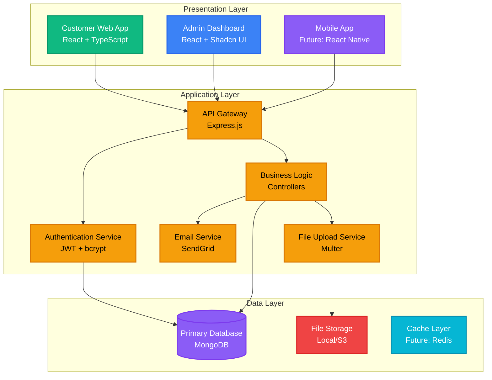

### Component Interaction Map

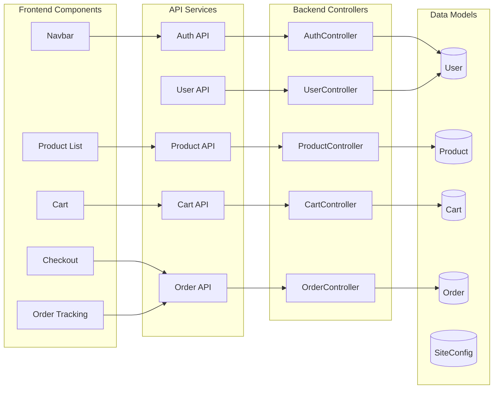

---

## 🏛️ Architecture Layers

### 1. Presentation Layer (Frontend)

#### Customer Store Architecture

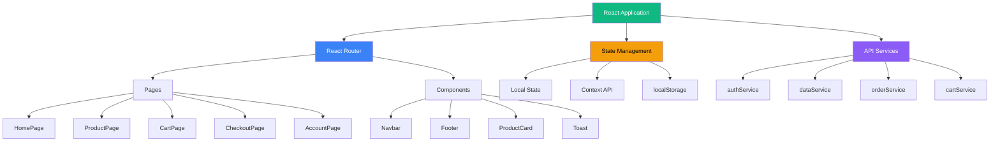

#### Admin Dashboard Architecture

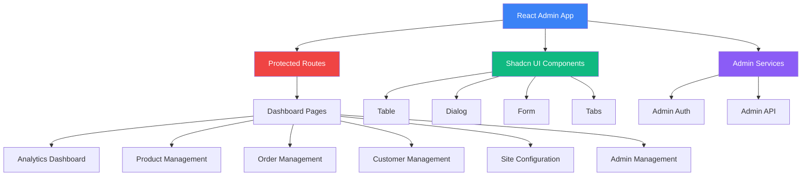

### 2. Application Layer (Backend)

#### MVC Pattern Implementation

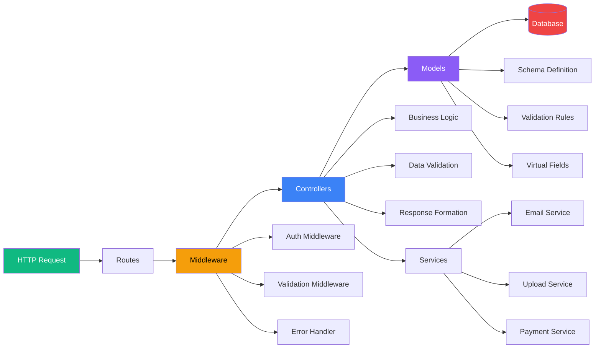

#### Request Processing Flow

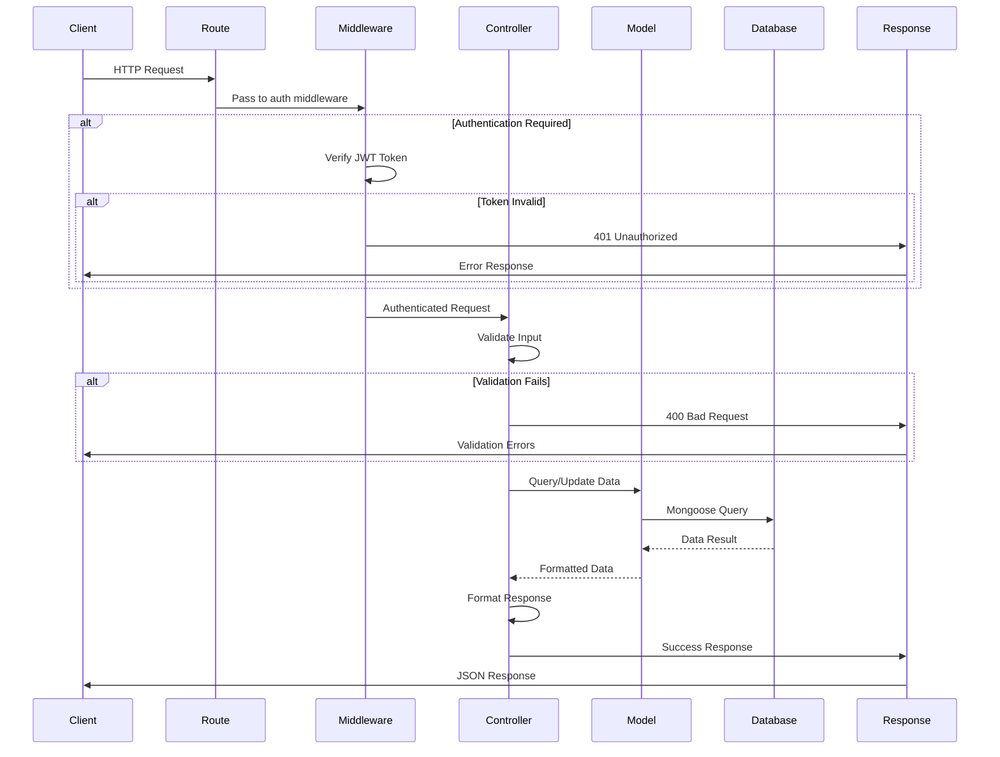

### 3. Data Layer

#### MongoDB Collections Structure

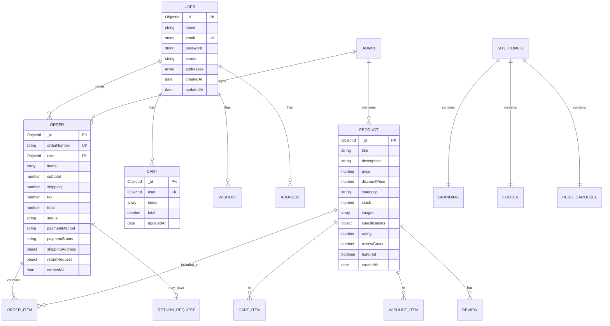

---

## 📊 Data Flow Diagrams

### User Registration & Authentication Flow

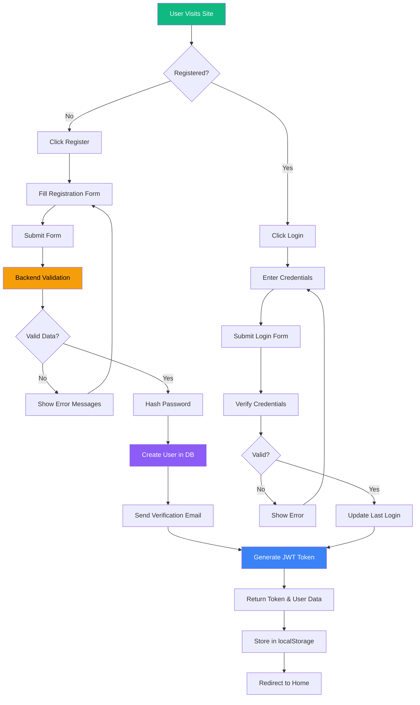

### Product Browsing & Purchase Flow

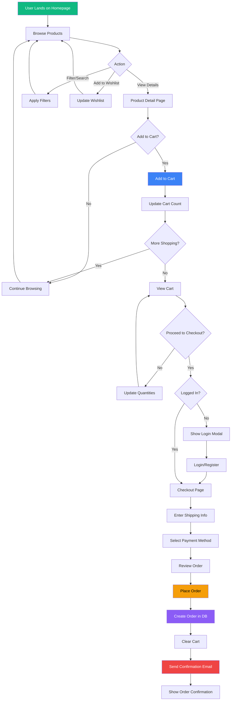

### Order Processing & Fulfillment Flow

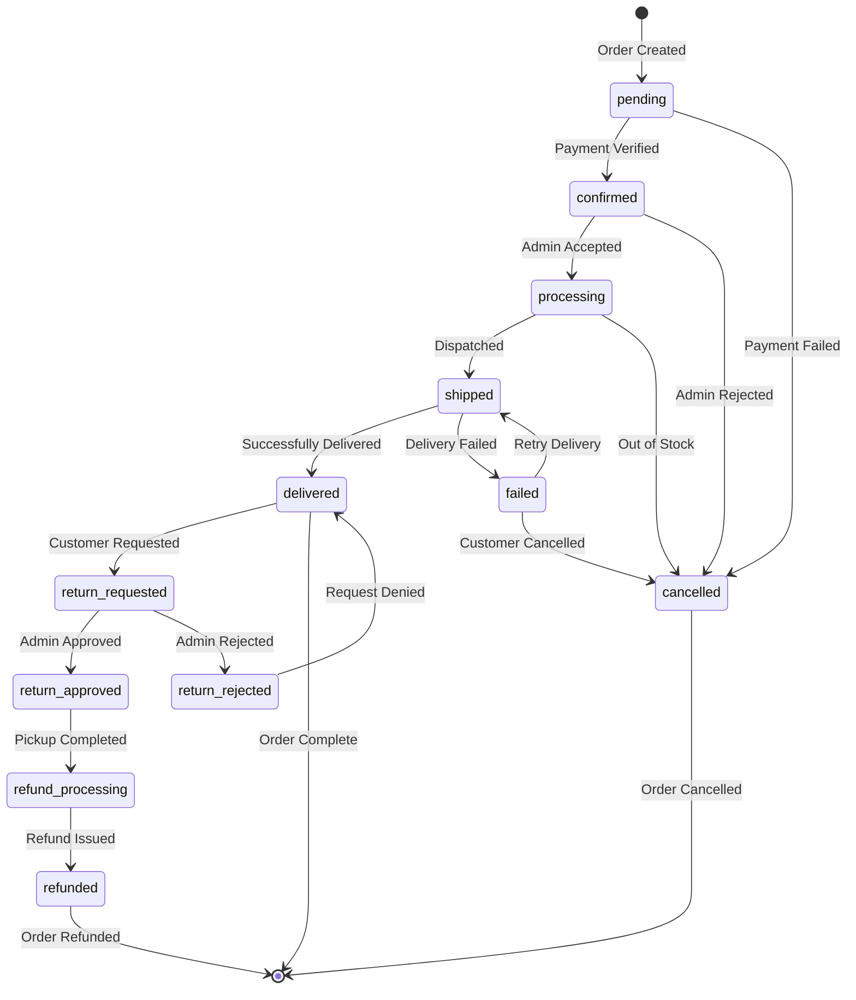

### Return Request Workflow

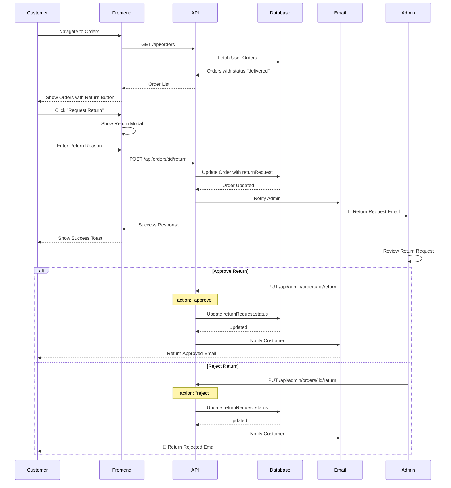

---

## 🔐 Security Architecture

### Authentication & Authorization Flow

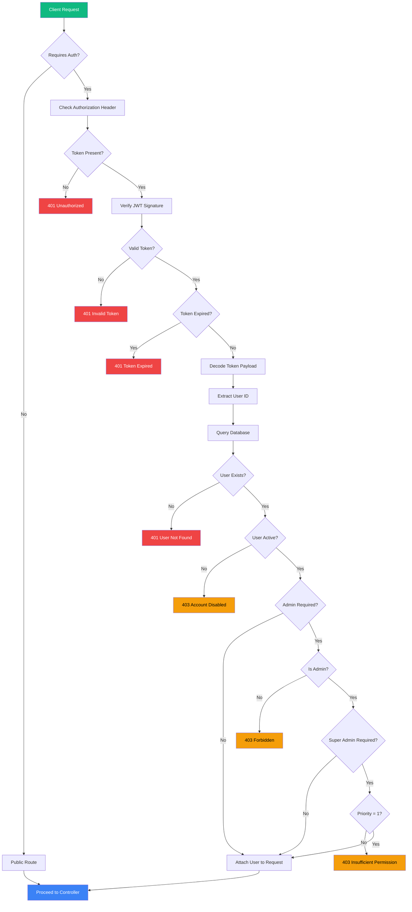

### Password Security Flow

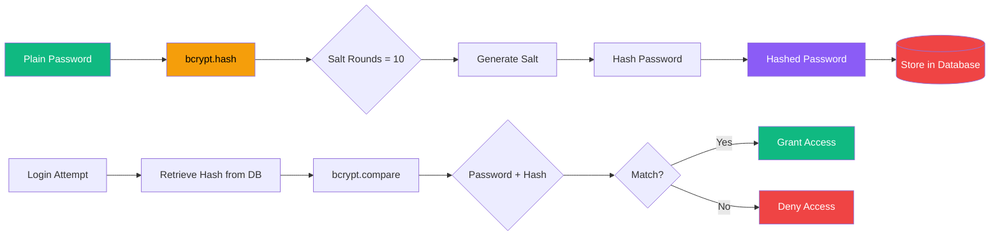

### JWT Token Structure

```
Header
{
  "alg": "HS256",
  "typ": "JWT"
}

Payload
{
  "id": "user123",
  "email": "user@example.com",
  "role": "customer",
  "iat": 1704970800,
  "exp": 1705575600
}

Signature
HMACSHA256(
  base64UrlEncode(header) + "." +
  base64UrlEncode(payload),
  secret
)
```

---

## 🚀 Deployment Architecture

### Production Deployment Diagram

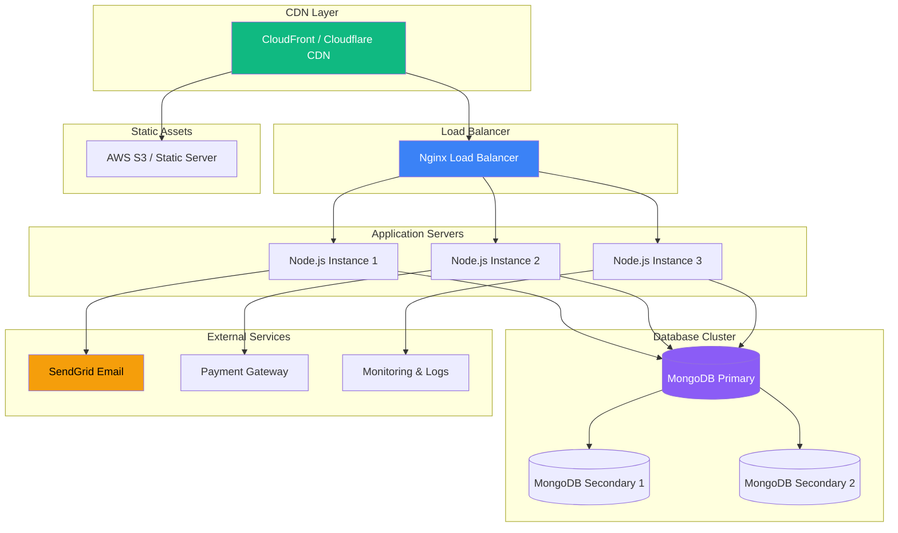

### Docker Container Architecture

```yaml
version: '3.8'

services:
  # Frontend Customer Store
  frontend:
    image: nutrinuts/frontend:latest
    ports:
      - "80:80"
    environment:
      - VITE_API_URL=http://backend:5001
    depends_on:
      - backend
    networks:
      - nutrinuts-network

  # Admin Dashboard
  admin:
    image: nutrinuts/admin:latest
    ports:
      - "8091:80"
    environment:
      - VITE_API_URL=http://backend:5001
    depends_on:
      - backend
    networks:
      - nutrinuts-network

  # Backend API
  backend:
    image: nutrinuts/backend:latest
    ports:
      - "5001:5001"
    environment:
      - DATABASE=mongodb://mongodb:27017/ecommerce
      - JWT_SECRET=${JWT_SECRET}
      - SENDGRID_API_KEY=${SENDGRID_API_KEY}
    depends_on:
      - mongodb
    networks:
      - nutrinuts-network
    volumes:
      - uploads:/app/images

  # MongoDB Database
  mongodb:
    image: mongo:7.0
    ports:
      - "27017:27017"
    volumes:
      - mongodb-data:/data/db
    networks:
      - nutrinuts-network

  # Redis Cache (Optional)
  redis:
    image: redis:7-alpine
    ports:
      - "6379:6379"
    networks:
      - nutrinuts-network

networks:
  nutrinuts-network:
    driver: bridge

volumes:
  mongodb-data:
  uploads:
```

---

## 📈 Scalability Patterns

### Horizontal Scaling Strategy

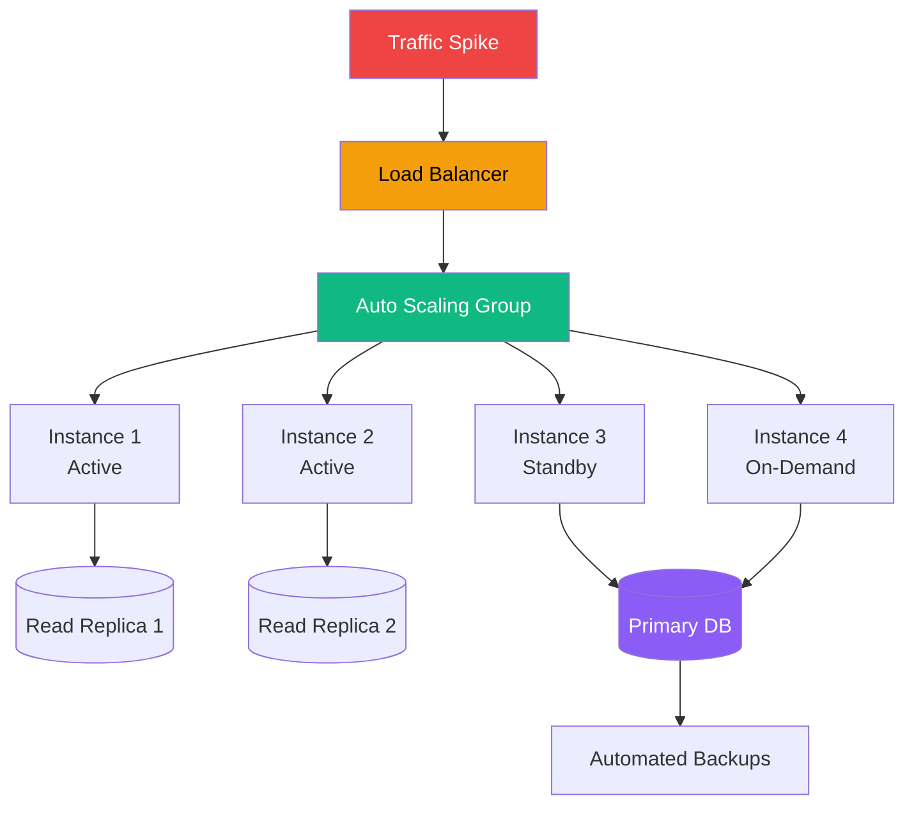

### Caching Strategy

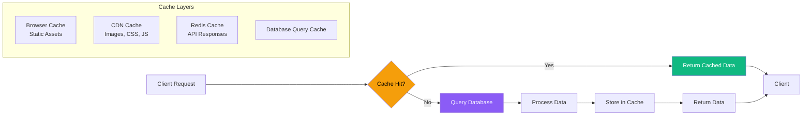

---

## 🔧 Design Patterns Used

### Repository Pattern

```typescript
// Product Repository Pattern
class ProductRepository {
  async findAll(filter, options) {
    return await Product.find(filter)
      .limit(options.limit)
      .skip(options.skip)
      .sort(options.sort);
  }
  
  async findById(id) {
    return await Product.findById(id);
  }
  
  async create(data) {
    return await Product.create(data);
  }
  
  async update(id, data) {
    return await Product.findByIdAndUpdate(id, data, { new: true });
  }
  
  async delete(id) {
    return await Product.findByIdAndDelete(id);
  }
}
```

### Service Layer Pattern

```typescript
// Order Service Pattern
class OrderService {
  constructor(orderRepository, emailService, inventoryService) {
    this.orderRepo = orderRepository;
    this.emailService = emailService;
    this.inventoryService = inventoryService;
  }
  
  async createOrder(orderData) {
    // 1. Validate inventory
    await this.inventoryService.checkStock(orderData.items);
    
    // 2. Create order
    const order = await this.orderRepo.create(orderData);
    
    // 3. Update inventory
    await this.inventoryService.decrementStock(orderData.items);
    
    // 4. Send confirmation email
    await this.emailService.sendOrderConfirmation(order);
    
    return order;
  }
}
```

### Middleware Pattern

```javascript
// Authentication Middleware Chain
app.use('/api/admin/*', [
  authMiddleware.verifyToken,
  authMiddleware.checkAdmin,
  authMiddleware.checkPermissions
]);
```

---

<div align="center">

**Architecture Documentation**

[📖 Back to Main Docs](../README.md) • [🌐 API Reference](API_REFERENCE.md) • [🗄️ Database Schema](01_Project_Overview.md#database-models)

---

*Last Updated: January 11, 2026*

</div>
